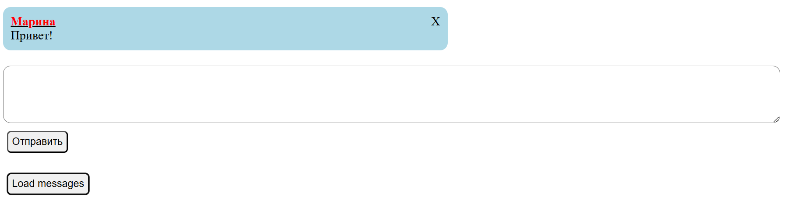

# Simple AJAX Chat
Это учебный проект, демонстрирующий реализацию чата с использованием асинхронного обмена данными между клиентом и сервером. Приложение позволяет отправлять и получать сообщения без перезагрузки всей страницы.

## О проекте
Проект написан для закрепления навыков работы с AJAX, манипуляций с DOM через jQuery и создания серверной части на Flask. Это классический пример «Single Page Application» (одностраничного приложения) на базовом уровне.

## Основные возможности
- Асинхронная отправка: Сообщения отправляются на сервер через POST запрос.
- Динамическая подгрузка: Список сообщений обновляется с сервера через GET запрос.
- Интерактивный UI: Анимированное скрытие сообщений и удобная верстка.
- Гибкость: Чат автоматически определяет, кто отправитель (вы или собеседник) и применяет соответствующие стили.

## Скриншот приложения


## Технологический стек
- **Backend:** Python, Flask
- **Frontend:** HTML, CSS, JavaScript (jQuery)
- **Библиотеки:** jQuery (для манипуляций с DOM и выполнения AJAX-запросов)
- **Обмен данными:** AJAX (POST/GET запросы)

## Как запустить проект
**Предварительные требования:**
- У вас должен быть установлен Python.

**Инструкция:**
1. Клонируйте репозиторий:
    ```bash
    git clone <https://github.com/NeganovaEvgeniya/simple-ajax-chat.git>
    cd simple-ajax-chat
    ```

2. Установите зависимости:
    ```bash
    pip install -r requirements.txt
    ```

3. Запуск сервера:
    ```bash
    python app.py
    ```

4. Работа с чатом:
Откройте браузер и перейдите по адресу: http://127.0.0.1:5000.

## Архитектура
Проект построен по принципу взаимодействия клиента и сервера через HTTP-запросы.